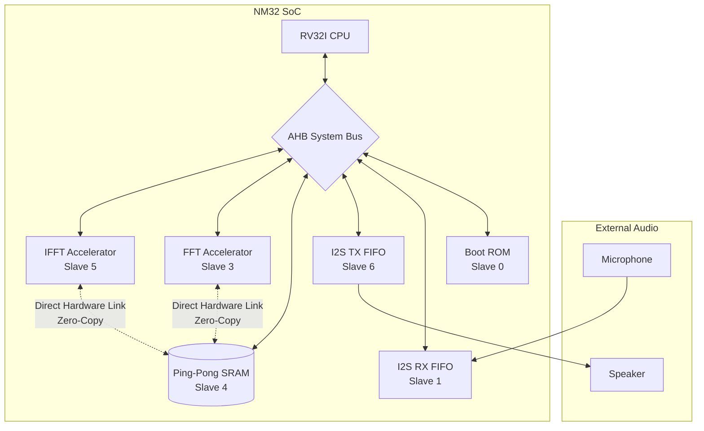

# NM32 SoC Specification Document 2.0 (Updated)

## Function of the SoC
The proposed System-on-Chip (SoC) is designed to selectively filter specific sounds from real-time audio based on reference audio samples recorded by the user. The primary application is in assistive headphones for people on the autism spectrum, who may find certain individual-specific sounds triggering. Instead of conventional active noise cancellation, which suppresses all environmental sound, this system allows users to suppress only personalised, selected sounds while allowing the rest of the auditory environment to remain audible.

The filtering is achieved by comparing the spectral characteristics of incoming real-time audio with the spectral characteristics of previously recorded trigger sounds.

The SoC operates in two modes: record mode and real-time mode, which can be toggled using a GPIO push button. In record mode, the user records fixed-length audio samples of sounds they wish to suppress using a microphone. These samples are processed to learn characteristic spectral patterns of the trigger sound. In real-time mode, the SoC continuously captures environmental audio through the microphone, processes it, and outputs filtered audio to a DAC connected to headphones.

In both modes, audio input is received through a microphone that transmits PCM samples via an I²S interface. The incoming samples are collected into frames and passed to an FFT accelerator for spectral analysis. The FFT output is then processed by the CPU. After the required processing in the spectral domain, the modified frequency components are forwarded to the IFFT block for time-domain reconstruction of the audio signal. The reconstructed samples are then transmitted through the I²S interface to the DAC.

In record mode, the recorded audio is used to compute feature vectors representing the characteristic spectral directions of the trigger sound. These vectors are learned using Oja’s rule. In real-time mode, each incoming frame’s spectrum is compared against the learned trigger subspace to attenuate the frequency bins corresponding to the trigger sound’s learned patterns.

## High-level Architecture & Dataflow
The SoC has been upgraded to a **Zero-Copy Ping-Pong architecture**. 

### Block Diagram

### Zero-Copy Hardware Flow
Previously, data was moved around extensively via DMA and the AHB bus. The new architecture features a dedicated, direct hardware connection between the FFT/IFFT accelerators and a shared **Ping-Pong SRAM buffer**. 
- The SRAM is divided into two distinct banks (Bank 0 and Bank 1) governed by a hardware `PING_PONG_CTRL` switch.
- While the hardware accelerators (FFT/IFFT) compute data in-place on one bank without using the AHB bus, the CPU (or DMA in the future) can simultaneously stream I²S audio in and out of the other bank.
- This entirely bypasses the AHB bus during mathematical processing, avoiding bottlenecks and saving thousands of clock cycles per frame.

## Interface pins
Port name | Direction | Function | Voltage (V)
--- | --- | --- | ---
core_clk | Input | Primary clock source | 1.8
rst_n | Input | SoC reset | 1.8
rx_i2s_sck | Output | Serial clock to MIC ADC | 1.8
rx_i2s_sd | Input | Serial data from MIC ADC | 1.8
rx_i2s_ws | Output | Serial Word select to MIC ADC | 1.8
tx_i2s_sck | Output | Serial clock to Speaker DAC | 1.8
tx_i2s_sd | Output | Serial data to Speaker DAC | 1.8
tx_i2s_ws | Output | Serial Word to Speaker DAC | 1.8
rec_real | Input | 1’b1 - record mode, 1’b0 - real time mode | 1.8
clr_rec | Input | Clears the recorded trigger patterns | 1.8
spi_sck | Output | SPI clock | 1.8
spi_mosi | Output | SPI Master out Slave in | 1.8
spi_miso | Input | SPI Master in Slave out | 1.8
spi_cs | Output | SPI chip select | 1.8
tck/tms/tdi/tdo/trst_n | I/O | JTAG interfaces | 1.8
func_test | Input | JTAG compliance pin (0 - func, 1 - test) | 1.8

## Clocks
Clock name | Clock frequency | Source
--- | --- | ---
core_clk | 150MHz - 200MHz | External source - through clock IO
i2s_lrclk | 15KHz | Divided from core_clk
i2s_blclk | 1MHz | Divided from core_clk
i2s_mclk | 3.84MHz | TBD (external source!)
spi_clk | 25MHz | Divided from core_clk
apb_clk | 75MHz - 100MHz | 1:2 of core_clk
ahb_clk | 150MHz - 200MHz | 1:1 of core_clk

## Key modules

### CPU & Instructions Used
**ISA:** RV32I processor with the M extension 
**Pipeline:** 1–3 stage in-order
**Privilege:** M-mode
**Memory:** Ping-Pong SRAM (on chip), Boot ROM

### FFT / IFFT Accelerators
A 256-point FFT accelerator is used for frequency domain calculations. It performs FFT as well as IFFT.
- **Direct Memory Access:** Accelerators directly access the shared Ping-Pong RAM for zero-copy computation.
- **Software Twiddle Factors (ROM Removal):** The massive twiddle ROM has been removed. Twiddle factors (sine/cosine coefficients) are embedded as software constants in the firmware (`.rodata`). During boot, the CPU loads these factors into a small internal twiddle RAM inside the accelerators over the AHB bus. This provides software flexibility and saves FPGA logic resources.

### Memory Modules
- **Ping-Pong SRAM Bank 0 & Bank 1:** Replaces individual scratchpads and FIFOs. Acts simultaneously as the FFT scratchpad, IFFT scratchpad, and Data RAM. Data is computed in-place. Read requests feature 1 wait-state to ensure absolute data integrity and prevent garbage data propagation.
- **Boot ROM:** Internal ROM for initial code execution.
- **I²S FIFOs:** Small FIFOs for RX and TX (currently 16 words, subject to increase) acting as the bridge for audio streaming.

## Work in progress / Roadmap
Based on the current architecture shift (50-60% completion), the remaining tasks focus heavily on microcontroller-level orchestration and software algorithms:
1. **Interrupts (PLIC):** Hook up the `fft_done`, `ifft_done`, and I2S FIFO flags to the PLIC (Interrupt Controller) and write C ISRs to replace CPU polling.
2. **DMA Controller Integration:** Connect the DMA to the AHB bus, configuring channels to handle I²S streaming to/from the Ping-Pong RAM in the background.
3. **SPI & External Flash:** Integrate the SPI controller to boot from external Flash and load instructions into an ITCM/DTCM separated structure.
4. **Peripherals Initialization:** Integrate and write drivers for GPIO, Watchdog, etc.
5. **Reset Controller:** Implement a dedicated Reset Controller (currently relying on simple active-low reset).
6. **Audio Filtration Algorithm:** Implement the high-level C audio filtration algorithm logic that sits between the FFT and IFFT processing phases.
